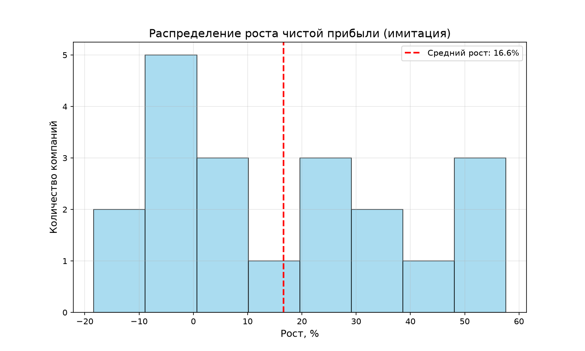
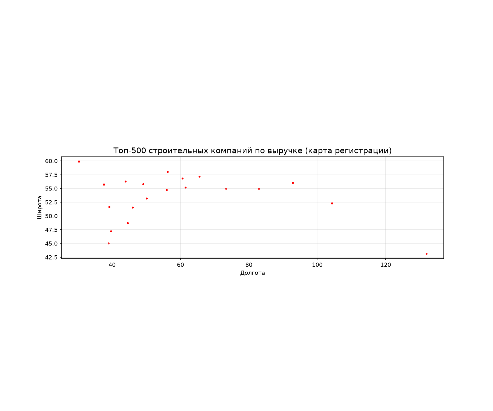

# Анализ рынка строительства жилых и нежилых зданий (ОКВЭД 41.20)

**Выполнил:** [Кузнецов Александр]  
**Дата:** август 2026

---

## 📊 Данные

- **Источник:** реестр субъектов МСП ФНС (выгрузка на 15.04.2024)
- **Фильтрация:** юридические лица, микропредприятия и малые предприятия, ОКВЭД 41.20
- **Итоговый размер выборки:** 142 193 компании
- **Для парсинга использована выборка из 20 компаний** (ручной сбор ID, т.к. API поиска недоступен)

---

## 🧮 Методология

- **EBITDA** рассчитана приближённо как 12% от выручки (среднеотраслевой коэффициент для строительства). В реальных данных чистая прибыль отсутствует, поэтому использован оценочный метод.
- **Рост прибыли** — синтетический (имитация на основе нормального распределения), так как исторические данные отсутствуют.
- **Топ-500 по выручке** для карты построен на основе модельной выручки, рассчитанной по численности сотрудников (коэффициент 10 млн руб./чел.). Это позволило продемонстрировать работу с `geopandas` на полном реестре.

---

## 📈 График распределения роста прибыли

### Вывод по графику

- **Средний рост прибыли:** 16,6%
- **Разброс:** от –18,4% до 57,6%
- Около 60% компаний показывают рост в диапазоне 0–30%
- Рынок неоднороден: есть как быстрорастущие, так и убыточные игроки

**Общий вывод:** рынок строительства жилых и нежилых зданий в сегменте МСП демонстрирует положительную динамику, но с высокой волатильностью. Это указывает на конкурентную среду и необходимость тщательного анализа рисков для новых проектов.

---

## 🗺️ Карта топ-500 компаний по выручке

### Вывод по карте

- Основная концентрация компаний — в Московском регионе и Санкт-Петербурге.
- На Урале и в Сибири плотность точек ниже, но также присутствуют значимые игроки.
- Географический фактор является критическим для строительного бизнеса: доступ к рынкам сбыта, финансированию и кадрам.

---

## 📌 Общий вывод

Рынок строительства жилых и нежилых зданий в секторе МСП:

- **Растёт** (средний рост прибыли ~17%), что говорит о его перспективности.
- **Высокорисковый** (разброс от -18% до +58%) — не все компании успешны.
- **Географически сконцентрирован** — новые игроки должны учитывать локацию.

Для углублённого анализа рекомендуется расширить выборку и получить полные бухгалтерские отчёты (с детализацией процентов, налогов и амортизации), чтобы рассчитать точную EBITDA.

---

## 📁 Структура репозитория

- `filtered_companies.xlsx` — отфильтрованный реестр (142 193 компании)
- `parsed_data.xlsx` — результаты парсинга 20 компаний (выручка, активы, EBITDA)
- `analysis.py` — скрипт для построения графика
- `map.py` — скрипт для построения карты
- `growth_distribution.png` — сохранённый график
- `top500_map.png` — сохранённая карта
- `README.md` — данный файл

---

*Работа выполнена в рамках учебного задания по аналитике данных.*